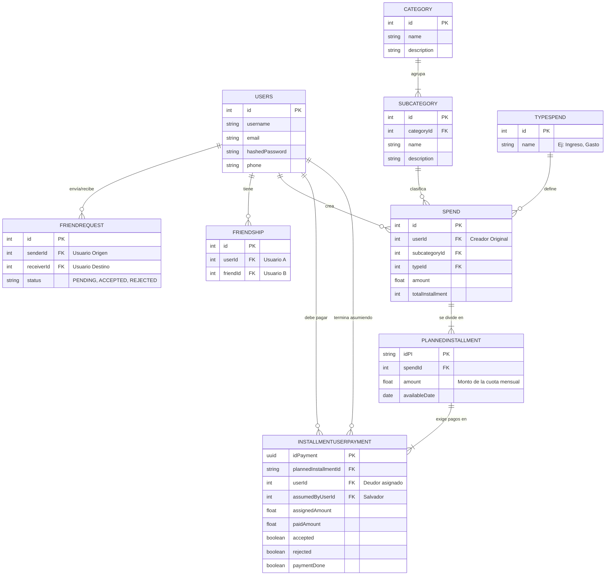
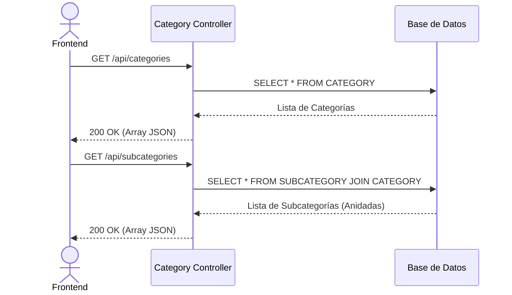
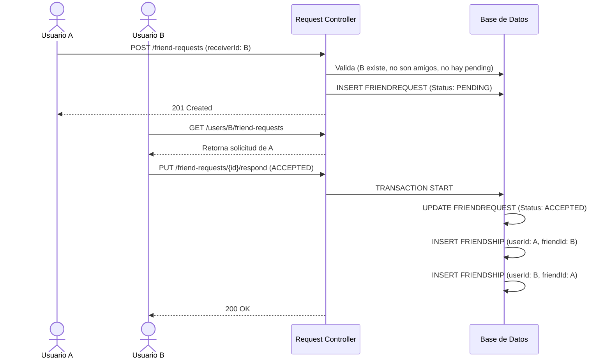
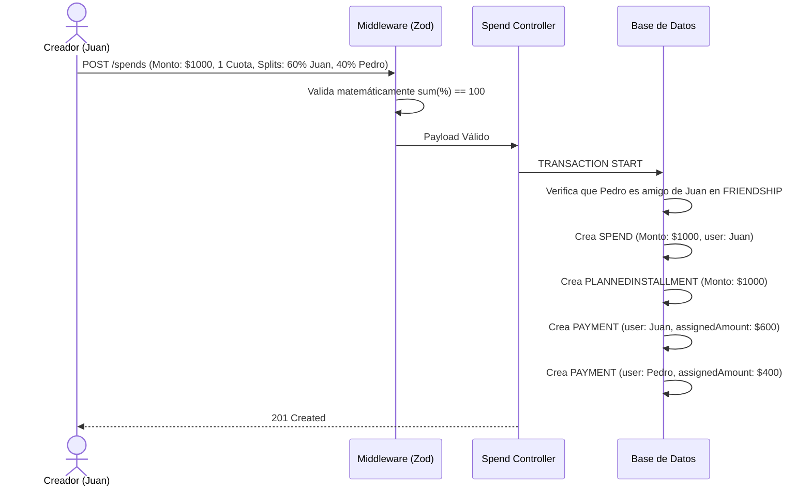
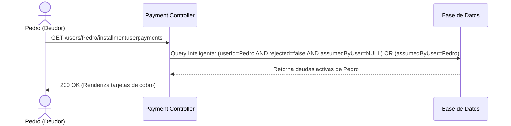
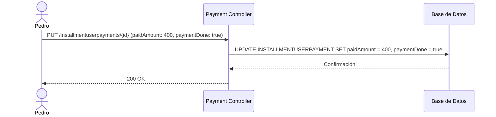
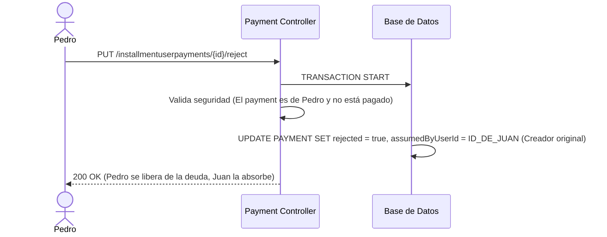
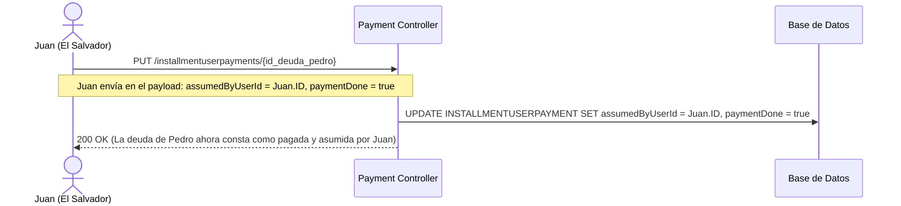

# 📖 Documentación de Arquitectura Completa: Universo FING

Este documento contiene la arquitectura técnica global, diagramas relacionales y de secuencia que cubren absolutamente todos los módulos operativos del backend de la aplicación.

---

## 1. 📊 Diagrama de Entidad Relación (ERD) Global

Representación integral de la Base de Datos.

---

## 2. 🔄 Universo de Flujos (Diagramas de Secuencia)

A continuación, el ecosistema completo de operaciones que puede realizar la app.

### Flujo 1: Carga de Catálogos (UI Setup)
Cuando el usuario abre el formulario para cargar un gasto, el Frontend necesita armar los "Combobox" (Selects).

### Flujo 2: Sistema Social (Amistades Bidireccionales)
El proceso para poder dividir cuentas requiere conectar cuentas primero.

### Flujo 3: Motor Transaccional de Gastos (Splitwise Mode)
El core financiero del sistema. Juan registra un almuerzo de $1000 dividido 60/40.

### Flujo 4: Dashboard de Deudas (Lectura Inteligente)
Cuando Pedro entra a su app, quiere ver "Cuánto dinero debe en total".

### Flujo 5: Pago Exitoso de una Deuda
Pedro decide pagar su parte ($400) de la cuota asignada.

### Flujo 6: Rechazo y Rebote Automático (Deuda Evadida)
Caso Borde: Pedro dice "Yo no pedí postre, no voy a pagar eso" y rechaza el cobro.

### Flujo 7: Rescate Financiero (Pagar por un amigo)
Caso Borde Heroico: Juan dice "Pedro no tiene dinero hoy, yo asumo su deuda voluntariamente".

---

## 3. 👤 Universo de Historias de Usuario

*   **HU-001 (Configuración):** Como *Usuario Administrador*, quiero poder dar de alta Categorías y Subcategorías para organizar estadísticamente el tipo de flujo financiero.
*   **HU-002 (Círculo Social):** Como *Usuario*, quiero poder enviar solicitudes de amistad mediante correo/ID a otras personas registradas, para formar un círculo de confianza financiera.
*   **HU-003 (Splits Equitativos):** Como *Creador de Gasto*, quiero registrar un ticket grande y dividir el peso financiero en porcentajes exactos con mi círculo social.
*   **HU-004 (Transparencia):** Como *Usuario Deudor*, quiero ver un Dashboard limpio que me muestre exactamente qué deudas están activas, ignorando las que ya rechacé, y resaltando las que mis amigos asumieron por mí.
*   **HU-005 (Libre Albedrío):** Como *Usuario Deudor*, quiero poder rechazar una asignación injusta, obligando a que la deuda rebote al creador sin corromper la integridad contable de la cuota mensual.
*   **HU-006 (Solidaridad):** Como *Usuario Salvador*, quiero tener la facultad de tomar la deuda de un amigo y marcarla como pagada asumiendo el rol en la base de datos, manteniendo un historial claro de los favores financieros.

---

## 4. 🧰 Casos de Uso del Ecosistema

1. **Catálogo:** Listar categorías con subcategorías anidadas. (Éxito).
2. **Seguridad API:** Intentar modificar o rechazar una cuota perteneciente a otro `userId` que no sea el propio. (Bloqueo `403 FORBIDDEN`).
3. **Validación Datos:** Intentar crear un gasto de 3 participantes sumando 90% en total. (Bloqueo en Middleware `400 BAD_REQUEST` Zod).
4. **Concurrencia Social:** Intentar enviar una amistad a alguien con quien ya hay un registro PENDING en estado inverso. (Bloqueo de Servicio `400 BAD_REQUEST`).
